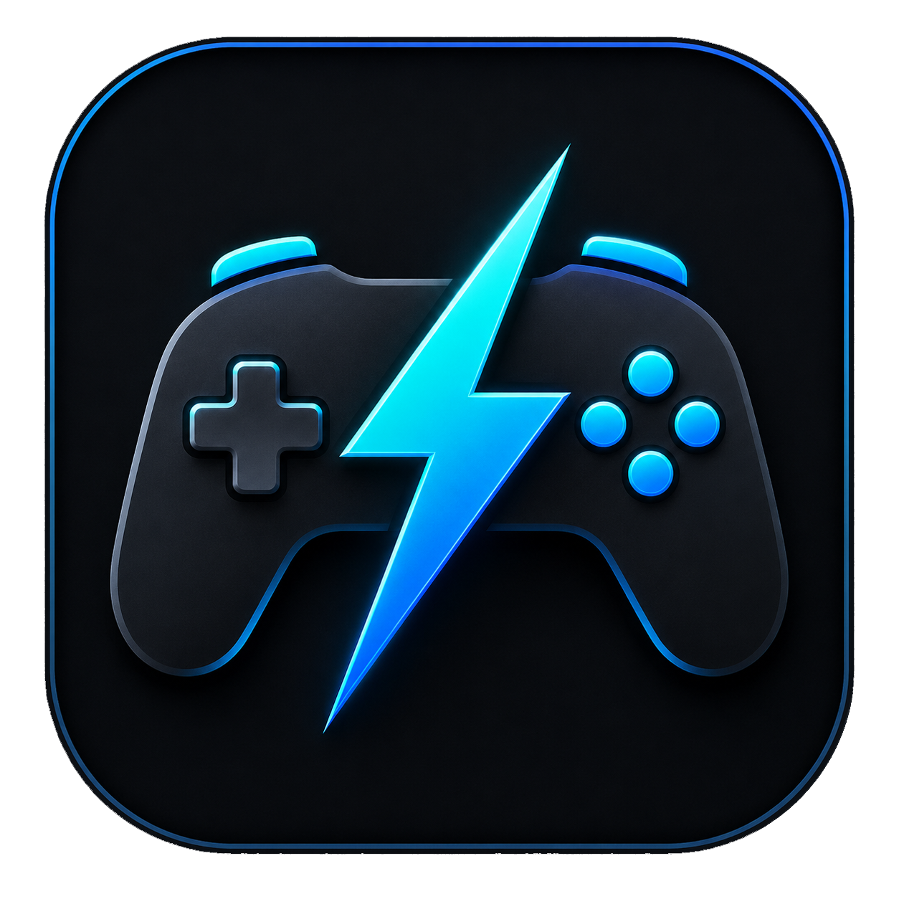

<p align="center">
  
</p>

<h1 align="center">Pad Trigger</h1>

<p align="center">
  A lightweight Windows tray tool for triggering actions when controllers, Bluetooth devices, and other supported devices connect or disconnect.
</p>

<p align="center">
  <strong>Version 1.2</strong>
</p>

---

## What is Pad Trigger?

Pad Trigger is a lightweight Windows tray tool that lets you run custom actions or scripts when a device connects or disconnects from your computer.

It is useful for setups where you want your PC to automatically react when a specific controller or Bluetooth device is turned on, connected, disconnected, or switched off.

For example, you can use it to:

* Switch Windows to TV mode when a controller connects
* Launch a game launcher like Playnite
* Change audio devices
* Run batch files, PowerShell scripts, VBS scripts, or EXE files
* Return your PC back to desktop mode when the controller disconnects
* Trigger actions from selected Bluetooth devices
* Link multiple controllers together so they behave like one shared trigger
* Hide devices you do not want to see in the main list
* Check for new versions directly from the app

---

## Features

### Controller detection

Pad Trigger detects connected game controllers and shows them in a simple list.

Supported controller-style devices can include:

* Xbox controllers
* 8BitDo controllers
* HOTAS devices
* Joysticks
* Racing wheels
* Other Windows-supported game controllers

Each device has:

* Device name
* Connection status
* Custom actions for connect
* Custom actions for disconnect

You can rename devices inside the app, so instead of confusing Windows device names, you can use names like:

* Xbox Controller
* 8BitDo Controller
* HOTAS Joystick
* Racing Wheel
* TV Mode Controller

---

### Linked devices

Pad Trigger can link multiple devices together so they act like one shared trigger group.

This is useful when two or more controllers use the same actions.

For example, if two controllers are linked:

* The first linked controller that connects runs the connect actions
* Any other linked controller that connects after that does not run the connect actions again
* Disconnecting one linked controller does not run the disconnect actions if another linked controller is still connected
* The last linked controller that disconnects runs the disconnect actions

This prevents duplicated actions, such as switching display modes or turning the TV on/off multiple times when multiple players connect controllers.

Linked devices are shown in the main list with a chain indicator.

---

### Bluetooth devices

Pad Trigger includes a **Bluetooth Devices** window.

From there, you can add supported Bluetooth devices to the main list and assign actions to them.

Bluetooth devices use their Windows Bluetooth names when available.

This allows you to trigger actions from selected Bluetooth devices without filling the main list with every device on your PC.

---

### Hidden devices

Pad Trigger includes a **Hidden Devices** window.

You can hide devices from the main list if you do not want to see them all the time.

Hidden devices are not deleted forever. You can bring them back later.

This is useful if Windows shows extra devices that you do not want in your main Pad Trigger list.

---

### Connect actions

You can assign one or more actions to run when a device connects.

Actions run from top to bottom.

Example connect actions:

```text
D:\Scripts\TV_Mode.bat
D:\Scripts\Launch_Playnite.bat
D:\Tools\SomeProgram.exe
```

---

### Disconnect actions

You can also assign one or more actions to run when a device disconnects.

Example disconnect actions:

```text
D:\Scripts\Desktop_Mode.bat
D:\Scripts\Restore_Audio.bat
```

---

### Multiple actions per device

Each device can have multiple connect and disconnect actions.

For example:

When a controller connects:

1. Turn on TV
2. Switch Windows display mode
3. Change audio output
4. Start Playnite

When the controller disconnects:

1. Switch back to desktop monitor
2. Restore desktop audio
3. Turn off TV

---

### Runs from the system tray

Pad Trigger is designed to stay out of the way.

When you close the main window, it keeps running in the Windows system tray near the clock.

From the tray icon, you can:

* Open Pad Trigger
* Open the About window
* Exit the app completely

---

### Start with Windows minimized

Pad Trigger can start automatically with Windows.

When enabled, it starts in the background and stays in the tray.

Important: Pad Trigger does not run disconnect actions just because Windows started and a device is already disconnected.

It only reacts after a device actually connects, then later disconnects.

---

### Check for updates

Pad Trigger includes a **Check for Updates** button.

The app can check the latest GitHub release and tell you if you are already using the latest version.

If a newer version is available, Pad Trigger can download and extract the latest release into the existing app folder.

---

### Fast controller detection

Pad Trigger uses a fast detection path for controllers so controller connect and disconnect events can be detected quickly.

Bluetooth devices use a separate detection path so Bluetooth scanning does not slow down controller detection.

---

### Light and dark theme

Pad Trigger includes both light and dark themes.

The app starts in dark theme by default. Users can switch to light theme whenever they want.

The selected theme is remembered automatically.

---

## How it works

Pad Trigger watches device state in Windows and checks for connection changes efficiently in the background.

When a device is detected as connected, Pad Trigger checks if that device was previously disconnected.

If yes, it runs the device's connect actions.

When the device later disconnects, Pad Trigger runs that device's disconnect actions.

Each device has its own saved configuration.

For linked devices, Pad Trigger treats the linked devices as one shared trigger group:

```text
First linked device connected = run connect actions once
Last linked device disconnected = run disconnect actions once
```

---

## Supported action types

Pad Trigger can run common Windows files, including:

```text
.exe
.bat
.cmd
.ps1
.vbs
```

PowerShell scripts are launched with:

```text
-NoProfile -ExecutionPolicy Bypass
```

This helps normal user scripts run without needing to manually change PowerShell execution policy.

---

## Configuration

Pad Trigger creates a local configuration file named:

```text
config.json
```

This file stores:

* Device names
* Device actions
* Theme setting
* Saved device profiles
* Linked devices
* Hidden devices

Do not upload your personal `config.json` publicly if it contains private paths or personal scripts.

---

## Example use case

A common use case is a living-room gaming PC setup.

Example:

When an Xbox controller connects:

```text
D:\Scripts\TV_Mode.bat
D:\Scripts\Launch_Playnite.bat
```

When the Xbox controller disconnects:

```text
D:\Scripts\Desktop_Mode.bat
```

This allows the controller to act like a trigger for switching between desktop mode and TV gaming mode.

If you have multiple controllers, you can link them together so only the first connected controller runs the TV mode actions, and only the last disconnected controller runs the desktop mode actions.

---

## Installation

Download the latest release from the Releases section.

Run:

```text
PadTrigger.exe
```

No installation is required.

---

## Requirements

* Windows 10 or Windows 11
* Windows-supported controller or Bluetooth device

The release build is intended to be self-contained, so normal users should not need to install Visual Studio or the .NET SDK.

---

## Building from source

To build Pad Trigger yourself:

1. Install Visual Studio
2. Install the `.NET desktop development` workload
3. Open the solution file
4. Restore NuGet packages
5. Build the project

The project uses:

```text
.NET 8
Windows Forms
SharpDX.DirectInput
```

---

## Project files

Important project files:

```text
Form1.cs
Program.cs
PadTrigger.csproj
pt.ico
pt.png
```

`pt.ico` is used for the Windows executable icon.

`pt.png` is embedded in the app and used for the large in-app icon.

---

## Made by

Tool made by **Valentin Yochev**.

YouTube channel:

[SPYBGWTVR on YouTube](https://www.youtube.com/@SPYBGWTVR)

---

## Support

If you like this tool and want to help me out, you can support the project here:

[Buy me a Beer](https://www.paypal.com/donate/?business=SLS9FP9VALFV4&no_recurring=0&item_name=Thank+you+for+supporting+this+project%21&currency_code=EUR)

You can also subscribe to my YouTube channel:

[Subscribe on YouTube](https://www.youtube.com/@SPYBGWTVR?sub_confirmation=1)

Thanks!

---

## License

This project is free and open source.

You are free to use, modify, and share it.
